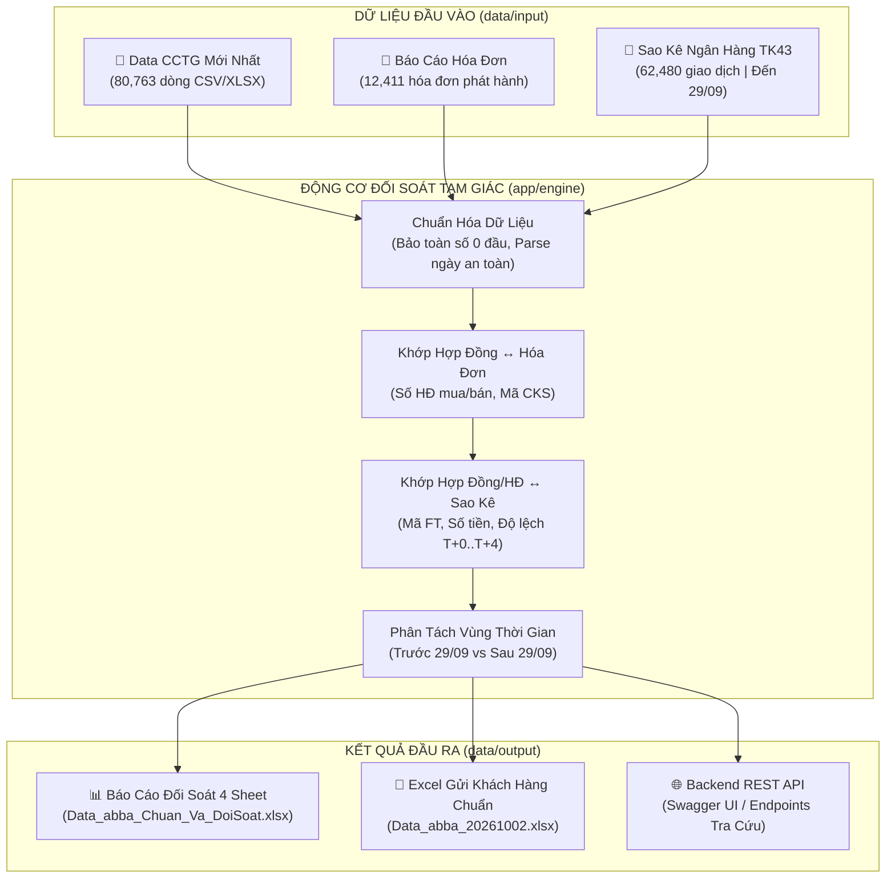

# 🏦 HỆ THỐNG ĐỐI SOÁT TAM GIÁC & XỬ LÝ DỮ LIỆU CCTG (ABBA)

> **Kiến trúc:** Enterprise Modular Architecture (v2.0)  
> **Hiệu năng:** Xử lý 80,763 dòng dữ liệu trong ~16s (Export) / ~32s (Đối soát 3 chiều)  
> **Tỷ lệ khớp chuẩn:** **97.6%** chuẩn tuyệt đối giữa Hợp đồng ↔ Hóa đơn ↔ Sao kê TK43  
> **Ngôn ngữ & Công nghệ:** Python 3.10+ | FastAPI | XlsxWriter | Pandas | Pydantic  

---

## 📌 MỤC LỤC
1. [Bức Tranh Tổng Thể & Sơ Đồ Đối Soát Tam Giác](#-1-bức-tranh-tổng-thể--sơ-đồ-đối-soát-tam-giác)
2. [Cẩm Nang Vận Hành 1-Click (Dành Cho Mọi Nhân Sự)](#-2-cẩm-nang-vận-hành-1-click)
3. [Cẩm Nang Đọc Hiểu Báo Cáo 4 Sheet & Quy Ước Mã Màu](#-3-cẩm-nang-đọc-hiểu-báo-cáo-4-sheet--quy-ước-mã-màu)
4. [Cấu Trúc Thư Mục Chuẩn Hóa & Thiết Kế Module](#-4-cấu-trúc-thư-mục-chuẩn-hóa--thiết-kế-module)
5. [Tài Liệu REST API & Tích Hợp Hệ Thống](#-5-tài-liệu-rest-api--tích-hợp-hệ-thống)
6. [Xử Lý Ngoại Lệ & Câu Hỏi Thường Gặp (FAQ)](#-6-xử-lý-ngoại-lệ--câu-hỏi-thường-gặp-faq)

---

## 🧭 1. Bức Tranh Tổng Thể & Sơ Đồ Đối Soát Tam Giác

Hệ thống giải quyết bài toán cốt lõi: **Xác thực dòng tiền thực tế tại ngân hàng (Sao kê TK43), tính hợp pháp hóa đơn thuế (Báo cáo Hóa đơn) và tính đầy đủ của dữ liệu quản lý hợp đồng CCTG (An Gia / ABBA).**



---

## ⚡ 2. Cẩm Nang Vận Hành 1-Click

Hệ thống được thiết kế để bất kỳ nhân sự nào (Kế toán, Quản lý vận hành hay Kiểm toán) đều có thể chạy chỉ bằng một cú double-click chuột:

| Tệp Chạy (Root Directory) | Thao tác | Chức năng & Kết quả |
| :--- | :---: | :--- |
| **[1_Chuyen_CSV_Sang_Excel.bat](file:///d:/D%E1%BB%B0%20%C3%81N%20ABBA/%C4%90%E1%BB%91i%20So%C3%A1t%20Raw%20APP/1_Chuyen_CSV_Sang_Excel.bat)** | Double-Click | **Xuất file Excel chuẩn ngân hàng gửi khách hàng:**<br>• Tự động nạp file CSV mới nhất tại `data/input/`.<br>• Bảo toàn nguyên vẹn số 0 ở đầu (CCCD, Sổ AZ, CIF, Series).<br>• Định dạng chuẩn tiền tệ (`#,##0`), ngày tháng (`DD/MM/YYYY`).<br>• Tệp đầu ra: `data/output/Data_abba_20261002.xlsx`. |
| **[2_Chay_Doi_Soat_Tam_Giac.bat](file:///d:/D%E1%BB%B0%20%C3%81N%20ABBA/%C4%90%E1%BB%91i%20So%C3%A1t%20Raw%20APP/2_Chay_Doi_Soat_Tam_Giac.bat)** | Double-Click | **Chạy toàn bộ tiến trình đối soát 3 chiều:**<br>• Đối chiếu chéo 80,763 dòng CCTG ↔ Hóa đơn ↔ Sao kê TK43.<br>• Xuất báo cáo Excel 5 sheet đầy đủ phân tích và cảnh báo.<br>• Tệp đầu ra: `data/output/Data_abba_Chuan_Va_DoiSoat.xlsx`. |
| **[3_Khoi_Chay_API_Server.bat](file:///d:/D%E1%BB%B0%20%C3%81N%20ABBA/%C4%90%E1%BB%91i%20So%C3%A1t%20Raw%20APP/3_Khoi_Chay_API_Server.bat)** | Double-Click | **Khởi động Backend REST API Server:**<br>• Địa chỉ máy chủ: `http://localhost:8000`<br>• Giao diện kiểm thử trực quan: `http://localhost:8000/docs`<br>• Nạp sẵn bộ đệm in-memory cho tốc độ phản hồi tức thì (<10ms). |
| **[4_Xuat_Du_Lieu_Clean_Core.bat](file:///d:/D%E1%BB%B0%20%C3%81N%20ABBA/%C4%90%E1%BB%91i%20So%C3%A1t%20Raw%20APP/4_Xuat_Du_Lieu_Clean_Core.bat)** | Double-Click | **Làm sạch dữ liệu chuyên dụng để import CD CORE DATA:**<br>• Bổ sung hóa đơn còn thiếu (BC Hoa don) & FT Mua (Sao kê TK43).<br>• Khắc phục dứt điểm xung đột HĐ 18715 Lâm Gia Phước (CIF 13558581).<br>• Phân bổ chênh lệch làm tròn 264 HĐ bán lẻ vào đơn giá: Tổng chi tiết khớp 100% Header và Sao kê.<br>• Tệp đầu ra: `data/output/Data_abba_Clean_Core.csv` & `.xlsx`. |

---

## 📊 3. Cẩm Nang Đọc Hiểu Báo Cáo 5 Sheet & Quy Ước Mã Màu

Tệp báo cáo **`Data_abba_Chuan_Va_DoiSoat.xlsx`** gồm 5 sheet chuyên biệt, giải quyết triệt để vấn đề trùng lặp dòng khi một hợp đồng có nhiều sổ AZ:

### 3.1. Danh mục các Sheet & Bộ Cột So Sánh Song Song (Side-by-Side)

1. **Sheet 1: `Tổng Quan` (Màu Xanh Dương)**
   - Dashboard chỉ số KPI toàn diện: Quy mô dữ liệu (80,763 dòng CCTG, 60,369 dòng sao kê đã khử 3,288 dòng trùng Bank, 12,411 dòng hóa đơn), kiểm tra đối soát cấp dòng, đối soát hợp đồng toàn diện (43,618 HĐ cả CNM & CNB), tổng hợp chênh lệch làm tròn bán lẻ (264 HĐ) và cảnh báo ngoại lệ chứng từ.
2. **Sheet 2: `Chi Tiết Theo Từng Dòng` (Màu Xanh Lá - 80,763 dòng)**
   - Toàn bộ 80,763 dòng dữ liệu gồm 61 cột (35 cột nghiệp vụ gốc + 26 cột đối chiếu song song trực quan):
     - **Cụm Mua:** `FT Mua (Data)` ↔ `FT Mua (Sao Kê)` ↔ `Mã HĐ (Sao Kê)` | `Ngày Mua (Data)` ↔ `Ngày Ghi Có (Sao Kê)` ↔ `Δ Ngày Mua` | `Tiền Mua HĐ (Data)` ↔ `Tiền Ghi Có (Sao Kê)` ↔ `Δ Tiền Mua`.
     - **Cụm Bán:** `FT Bán (Data)` ↔ `FT Bán (Sao Kê)` | `Ngày Bán Data` ↔ `Ngày Ghi Nợ (Sao Kê)` ↔ `Δ Ngày Bán` | `Tiền Bán HĐ (Data)` ↔ `Tiền Ghi Nợ (Sao Kê)` ↔ `Δ Tiền Bán`.
     - **Cụm Hóa Đơn:** `Mã HĐ (Hóa Đơn)` ↔ `Số Hóa Đơn` ↔ `Ký Hiệu` ↔ `Ngày HĐ` ↔ `Tiền HĐ` ↔ `Δ Tiền HĐ (Data - HĐ)`.
     - **Cụm Đánh Giá:** `[CỜ ĐỐI SOÁT & TRẠNG THÁI]`, `[CHI TIẾT ĐIỀU CHỈNH / ĐỐI SOÁT]`, `[HƯỚNG DẪN XỬ LÝ]`.
3. **Sheet 3: `Chi Tiết Theo Hợp Đồng` (Màu Tím - 43,619 hợp đồng: Đầy đủ cả CNM & CNB)**
   - Đối chiếu cấp Hợp đồng không trùng lặp dòng (1 dòng duy nhất / hợp đồng), tích hợp song song cả 2 chiều Mua và Bán (27 cột):
     - **Thông tin chung:** `STT`, `Mã HĐ Mua (CNM)`, `Mã HĐ Bán (CNB)`, `Số CIF`, `Tên Khách Hàng`, `Mã CCTG`, `Số Lượng Sổ AZ`, `Tổng SL CCTG`.
     - **Chiều Mua (CNM):** `Ngày Mua`, `Số FT Data`, `Số FT Sao Kê`, `Tiền Tính Toán (SL x Mệnh Giá)`, `Tiền Khai Báo (Header)`, `Tiền Ghi Có (Sao Kê)`, `Tiền Hóa Đơn (HĐĐT)`, `Δ Tiền Bank (Bank - Data)`, `Δ Tiền Hóa Đơn (Data - HĐ)`.
     - **Chiều Bán (CNB):** `Ngày Bán`, `Số FT Data`, `Số FT Sao Kê`, `Tiền Tính Toán (SL x Đơn Giá)`, `Tiền Khai Báo (Header)`, `Tiền Ghi Nợ (Sao Kê)`, `Chênh Lệch Bán Lẻ (Bank - Data)`.
     - **Đánh Giá HĐ:** `[Đánh Giá HĐ] Cờ Trạng Thái Hợp Đồng`, `[Đánh Giá HĐ] Chi Tiết Ghi Chú Đối Soát`, `[Đánh Giá HĐ] Hướng Dẫn Xử Lý Kế Toán`.
     - **Sắp xếp trực quan:** Toàn bộ 230 hợp đồng Tháng 9 có sai số làm tròn bán lẻ được đẩy lên đầu (dòng 1 → 230, màu Xanh Teal `#E8F8F5`), theo sau là các tháng khác, hợp đồng cảnh báo (Đỏ/Vàng) và hợp đồng khớp chuẩn 100% (Xanh lá).
4. **Sheet 4: `Chênh Lệch Bán Lẻ` (Màu Xanh Cổ Vịt #0E6251)**
   - Bảng biểu chuyên dụng cho 264 hợp đồng bán lẻ CCTG qua App có sai số làm tròn số học (Toàn bộ $\Delta < 2.000$ đ).
   - **Sắp xếp ưu tiên:** 230 hợp đồng của Tháng 9/2026 được xếp lên đầu (STT 1 → 230). Theo sau là 34 hợp đồng của Tháng 8 và Tháng 6.
   - Có cột `Kỳ Bán` (`09/2026`, `08/2026`, `06/2026`) để lọc theo từng tháng một cách linh hoạt.
   - Dòng 1 có công thức `=SUM(...)` cố định (Freeze Panes):
     - `SL x Đơn giá (Data)`: **205.882.227.299 đ** (T9: 169.958.631.355 đ)
     - `Sao kê (Bank Ghi Nợ)`: **205.882.229.204 đ** (T9: 169.958.633.549 đ)
     - `Chênh Lệch`: **-1.905 đ** (T9: -2.194 đ | 100% là sai số làm tròn số học $< 2.000$ đ do chia đơn giá lẻ trên từng sổ AZ).
5. **Sheet 5: `HĐ & Sao Kê Ngoại Lệ` (Màu Cam #ED7D31)**
   - Danh sách các hợp đồng ngoại lệ chứng từ: Đã xuất HĐ và đã thu tiền đầy đủ trên Sao kê TK43 nhưng Core CCTG chưa nạp dữ liệu sổ AZ (KH Lâm Gia Phước - 550.000.000 đ - FT26246688668854).

### 3.2. Quy ước mã màu trực quan trên từng dòng dữ liệu

| Mã Màu | Trạng Thái Dòng | Ý Nghĩa Nghiệp Vụ & Hành Động Cần Thiết |
| :---: | :--- | :--- |
| 🟢 **Xanh lá (Green)** | `Khớp Chuẩn 100% (Không Lệch)` | Dữ liệu hoàn hảo 100%: Khớp đồng thời cả Data ↔ Hóa đơn ↔ Sao kê TK43 (đúng số tiền đến từng đồng 0đ chênh lệch, đúng mã FT, trong phạm vi ngày cho phép). |
| 💠 **Xanh Bạc Hà (Teal)** | `Lệch Làm Tròn Bán Lẻ (< 2,000 đ)` | Có chênh lệch số học nhỏ (từ 1 đ đến 1.354 đ) do nhân chia đơn giá lẻ trên từng sổ AZ của App. Được gắn cờ `ℹ️ LÀM TRÒN: Lệch làm tròn bán lẻ (±... đ)` để kế toán hạch toán điều chỉnh chi phí/lãi. |
| 🟡 **Vàng (Yellow)** | `Cần Lưu Ý / Chờ Đối Soát` | • **Giao dịch chờ sao kê đợt mới:** Phát sinh sau ngày chốt sao kê.<br>• **Giao dịch thanh toán nội bộ ABBANK** hoặc HĐ bán chưa đến ngày thu tiền. |
| 🔴 **Đỏ (Red)** | `Lỗi / Sai Lệch Thực Tế` | Có sai lệch thực tế: Lệch số tiền $\ge 2.000$ đ giữa sao kê và hợp đồng, không tìm thấy hóa đơn tương ứng, hoặc sai lệch ngày vượt quá độ trễ cho phép (T+4). Cần kế toán kiểm tra lại chứng từ. |

---

## 🏛️ 4. Cấu Trúc Thư Mục Chuẩn Hóa & Thiết Kế Module

Dự án áp dụng mô hình phân tách trách nhiệm (Separation of Concerns):

```
D:\DỰ ÁN ABBA\Đối Soát Raw APP\
│
├── 1_Chuyen_CSV_Sang_Excel.bat       # Phím tắt chuyển CSV -> Excel
├── 2_Chay_Doi_Soat_Tam_Giac.bat      # Phím tắt chạy đối soát tam giác
├── 3_Khoi_Chay_API_Server.bat        # Phím tắt khởi động API
├── README.md                         # Cẩm nang tổng thể dự án
│
├── app/                              # Mã nguồn Python chuẩn hóa
│   ├── core/                         # Module Cốt Lõi
│   │   ├── config.py                 # Hằng số, dung sai tiền tệ (1.0 VND), đường dẫn động
│   │   └── parsers.py                # Regex FT/HĐ, chuẩn hóa mã chuỗi, parse ngày an toàn
│   │
│   ├── engine/                       # Module Động Cơ Đối Soát
│   │   └── reconcile_engine.py       # Thuật toán đối soát tam giác & xuất 4 sheet Excel
│   │
│   ├── exporter/                     # Module Xuất Bản Định Dạng Cao Cấp
│   │   └── excel_exporter.py         # Engine ghi trực tiếp XlsxWriter giữ số 0, format số/ngày
│   │
│   └── api/                          # Module RESTful API Cổng Tra Cứu
│       ├── main.py                   # Khởi tạo FastAPI, CORS, Lifespan cache
│       ├── routes.py                 # Danh sách endpoints (/health, /run, /summary, /problems...)
│       ├── schemas.py                # Pydantic schemas kiểm định kiểu dữ liệu
│       └── service.py                # Tầng nghiệp vụ Service Layer & in-memory cache
│
├── data/                             # Phân Vùng Dữ Liệu Độc Lập
│   ├── input/                        # Nơi chứa file gốc đầu vào (Data CSV, Hóa đơn, Sao kê)
│   ├── output/                       # Nơi chứa file xuất bản (Báo cáo đối soát, Excel gửi khách)
│   └── archive/                      # Nơi lưu trữ dữ liệu các kỳ trước (Data cũ 29/09...)
│
└── docs/                             # Thư Mục Tài Liệu Kỹ Thuật
    ├── README_API.md                 # Hướng dẫn chi tiết API & mã nguồn React tích hợp
    └── bank-reconcile-plan.md        # Tài liệu giải thuật và 10 quy tắc nghiệp vụ
```

---

## 🌐 5. Tài Liệu REST API & Tích Hợp Hệ Thống

Khi khởi chạy [3_Khoi_Chay_API_Server.bat](file:///d:/D%E1%BB%B0%20%C3%81N%20ABBA/%C4%90%E1%BB%91i%20So%C3%A1t%20Raw%20APP/3_Khoi_Chay_API_Server.bat), hệ thống cung cấp các endpoint sẵn sàng kết nối với Frontend (React, Vue, Portal nội bộ):

| Phương thức | Đường dẫn | Chức năng | Tham số mẫu |
| :---: | :--- | :--- | :--- |
| `GET` | `/api/health` | Kiểm tra tình trạng server | Không |
| `POST` | `/api/reconcile/run` | Kích hoạt chạy lại đối soát | `{ "data_path": "...", "hd_path": "..." }` (Tùy chọn) |
| `GET` | `/api/reconcile/summary` | Lấy dữ liệu KPI tổng quan | Trả về: `pct_golden`, `total_rows`, `count_discrepancy`... |
| `GET` | `/api/reconcile/problems` | Lấy danh sách dòng lỗi (Phân trang) | `page=1&page_size=50&search=FT2624` |
| `GET` | `/api/reconcile/export` | Tải về file Excel 4 sheet trực tiếp | Tải xuống file `.xlsx` hoàn chỉnh |

*Tài liệu chi tiết và code mẫu tích hợp TypeScript/React xem tại [docs/README_API.md](file:///d:/D%E1%BB%B0%20%C3%81N%20ABBA/%C4%90%E1%BB%91i%20So%C3%A1t%20Raw%20APP/docs/README_API.md).*

---

## 🔍 6. Xử Lý Ngoại Lệ & Câu Hỏi Thường Gặp (FAQ)

### Q1: Tại sao có 1,922 dòng có màu vàng với nhãn "Chờ Sao kê TK43 đợt mới"?
> **Trả lời:** Tệp `saoke_TK43.xlsx` hiện tại chốt dữ liệu đến ngày **29/09/2026**. Bộ dữ liệu mới `Data_abba_20261002.csv` có các hợp đồng phát sinh vào ngày **30/09/2026** và **01/10/2026** (1,922 dòng). Vì sao kê chưa có dữ liệu của 2 ngày này, hệ thống thông minh tự động gắn nhãn thông tin để **tránh báo lỗi sai lệch nhầm cho kế toán**. Khi nhận được file sao kê TK43 đợt mới có ngày 30/09 và 01/10, chỉ cần đặt vào `data/input/` và chạy lại, các dòng này sẽ tự động chuyển sang màu Xanh.

### Q2: Trường hợp ngoại lệ ở Sheet 4 là gì và cần xử lý như thế nào?
> **Trả lời:** Hệ thống phát hiện duy nhất **01 giao dịch ngoại lệ**:
> - Khách hàng: **Lâm Gia Phước**
> - Số tiền: **550,000,000 VND** | Ngày giao dịch: **03/09/2026**
> - Số hóa đơn: **18715** (Ký hiệu `1C26TCN`)
> - Mã sao kê ngân hàng: `FT26246688668854\B29`
> - Số hợp đồng trên hóa đơn: `CNM-13558581-1788395225436`
> 
> 👉 **Hành động xử lý:** Tiền thực tế **đã vào tài khoản ngân hàng** và **đã xuất hóa đơn**, nhưng hệ thống Data CCTG chưa ghi nhận dòng này. Kế toán cần thông báo bộ phận IT/Vận hành nạp hợp đồng này vào hệ thống CCTG để không bị sót doanh thu.

### Q3: Mở file Excel xuất ra trên máy tính có bị mất số `0` ở đầu CCCD / Số Sổ AZ không?
> **Trả lời:** **Không bao giờ bị mất.** Engine xuất bản tại [app/exporter/excel_exporter.py](file:///d:/D%E1%BB%B0%20%C3%81N%20ABBA/%C4%90%E1%BB%91i%20So%C3%A1t%20Raw%20APP/app/exporter/excel_exporter.py) đã ép kiểu chuỗi văn bản (`worksheet.write_string`) cho toàn bộ các cột định danh (`Số định danh/CCCD/MST`, `Số CIF`, `Số sổ AZ`, `Số series`). Khi mở trên bất kỳ phiên bản Microsoft Excel hay Google Sheets nào, các số như `00123...` đều được bảo toàn 100%.

### Q4: Muốn thay đổi file dữ liệu đầu vào thì làm như thế nào?
> **Trả lời:** Chỉ cần sao chép file mới vào thư mục [data/input/](file:///d:/D%E1%BB%B0%20%C3%81N%20ABBA/%C4%90%E1%BB%91i%20So%C3%A1t%20Raw%20APP/data/input/):
> - File dữ liệu CCTG: Đặt tên dạng `Data_abba_YYYYMMDD.csv` hoặc `.xlsx` (hệ thống sẽ tự động ưu tiên lấy file có ngày mới nhất).
> - File hóa đơn: Đặt tên `BC Hoa don.xlsx`.
> - File sao kê: Đặt tên `saoke_TK43.xlsx`.
> 
> Sau đó chạy file `2_Chay_Doi_Soat_Tam_Giac.bat` là hoàn tất!

---

*Hệ thống được thiết kế, tối ưu hóa và bảo trì bởi Bộ Phận Kỹ Thuật & Dữ Liệu ABBA.*
